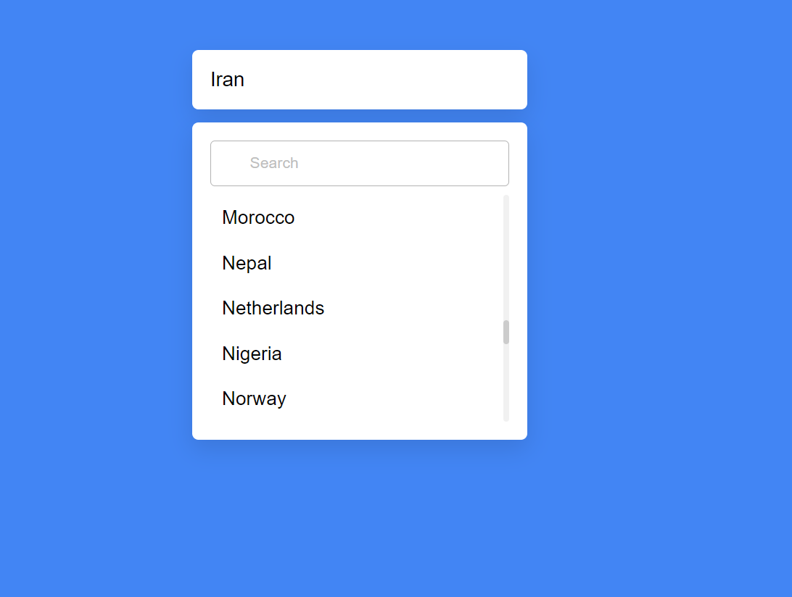

# customSelectMenu

this is a select menu , you can select options and search beetween them 

- when you click one of options it will take  ` .active   ` class

 - When you search for a word that does not exist, an error will be shown to the user 

## preview  
 check this project [Online](https://ariansefatdeveloper.github.io/customSelectMenu/)